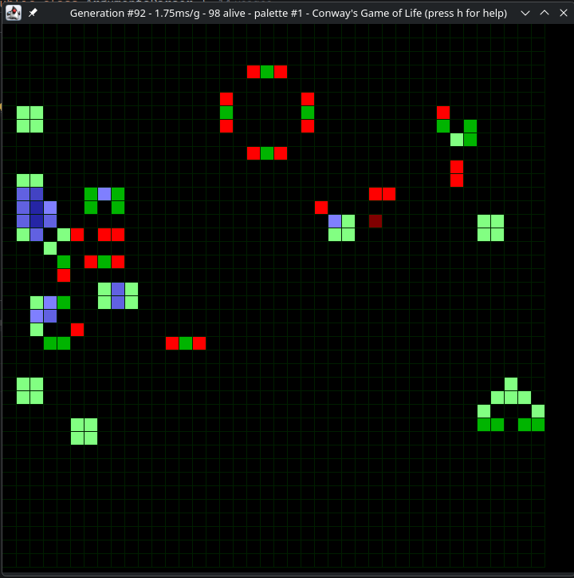

# Game of Life
A Game of Life I wrote for the University.

**Note:** Creative Mode has a hardcoded system hostname to prevent the professor from crashing my code. It's in ArgumentsParser.java if you want to remove it, go ahead!

There were several restrictions, hence why the code looks weird:
- No more than one return per function
- Parameters have weird restrictions (for example, width can only be 10/20/40/80 by default)
- No OOP (somehow using a **record** didn't apply)
- Had to use meaningful names everywhere (I guess this is justified)

### Features implemented
- The basic rules
- A Graphical User Interface made in Swing, that includes:
    - Several different color palettes
    - A custom view that shows cells in different colors based on neighbor count
    - Window and grid both resize automatically based on window size
    - Telemetry data on the window title
- Creative mode, a thing that removes weird restriction the university required.
- 5 different neighborhood check types:
    - 1: Checks in a cross pattern
    - 2: Checks all cells except bottom-left and top-right
    - 3: Checks all 8 neighbor cells
    - 4: Checks in an X pattern (inverse of 1)
    - 5: Checks all cells except every one in row 1
- 3 different argument parsers
    - Equal sign syntax: w=10, h=20 (key=value)
    - GNU short syntax: -w 10, -h=20 (-k value, -k=value)
    - GNU long syntax: --width 10, --height=20 (--key value --key=value)

### Available options
| Short key |      Long key     | Description                                                                                   |        Non-creative restrictions       |          Creative restrictions         | Is it required in non-creative mode? |
|:---------:|:-----------------:|-----------------------------------------------------------------------------------------------|:--------------------------------------:|:--------------------------------------:|:------------------------------------:|
|   w=, -w  |      --width      | Sets the grid width                                                                           |       Can only be 10, 20, 40, 80       |                  >= 1                  |                  Yes                 |
|   h=, -h  |     --height      | Sets the grid height                                                                          |         Can only be 10, 20, 40         |                  >= 1                  |                  Yes                 |
|   g=, -g  |   --generations   | Sets how many generations to calculate (0 = unlimited)                                        |                  >= 0                  |                  >= 0                  |                  Yes                 |
|   s=, -s  |      --speed      | Sets how many milliseconds to sleep between generations                                       |    Between 250 and 1000 (inclusive)    |                  >= 0                  |                  Yes                 |
|   n=, -n  |   --neighborhood  | Sets the neighborhood checking type (see above)                                               |             Between 1 and 5            |             Between 1 and 5            |          No (defaults to 3)          |
|   p=, -p  |    --population   | Sets the initial population with a special syntax 0 = dead cell, 1 = alive cell, # = next row | Can't be wider or taller than the grid | Can't be wider or taller than the grid |                  Yes                 |
|   x=, -x  | --skip-generation | Skips a specific generation. This was done in <10mins while defending the project.            |                  >= 0                  |                  >= 0                  |                  No                  |
|     -C    |     --creative    | Enables Creative Mode, disabling several restrictions (crashes may occur)                     |                   N/A                  |                   N/A                  |                  No                  |
|     -G    |    --graphical    | Enables Graphical Mode, showing a GUI when simulation starts                                  |                   N/A                  |                   N/A                  |                  No                  |
|     -S    |      --silent     | Disables console output, useful when used with -G or when benchmarking                        |                   N/A                  |                   N/A                  |                  No                  |
|     -M    |   --neighbor-map  | Enables a special mode in -G that changes cell colors depending on their neighbor count       |                   N/A                  |                   N/A                  |                  No                  |

